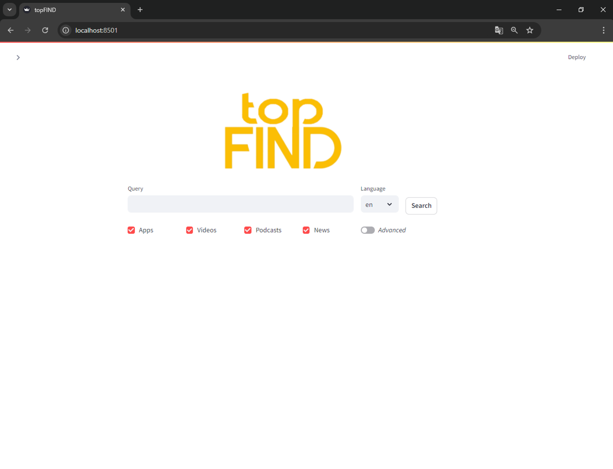
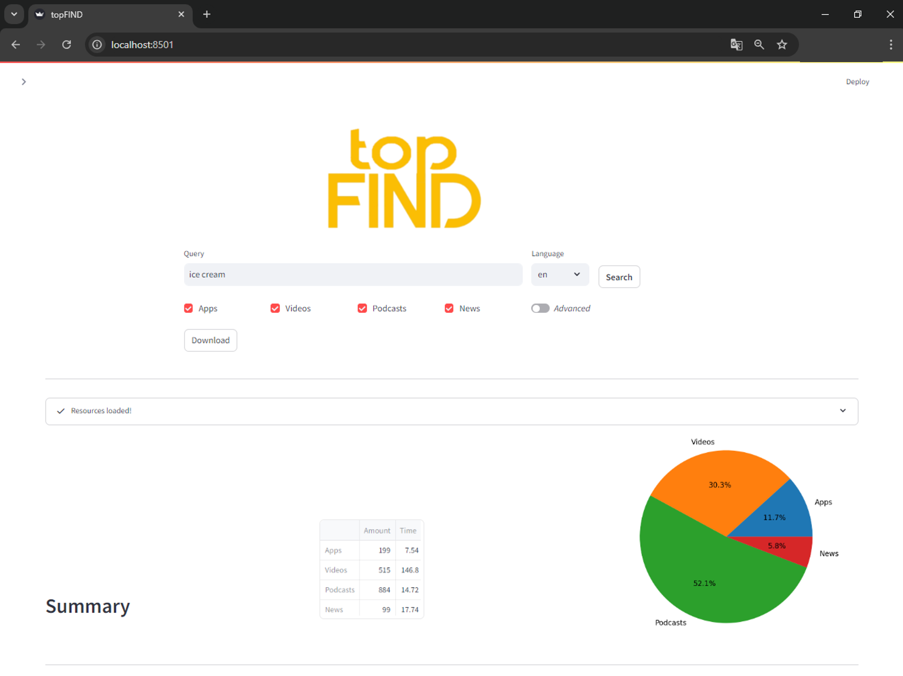
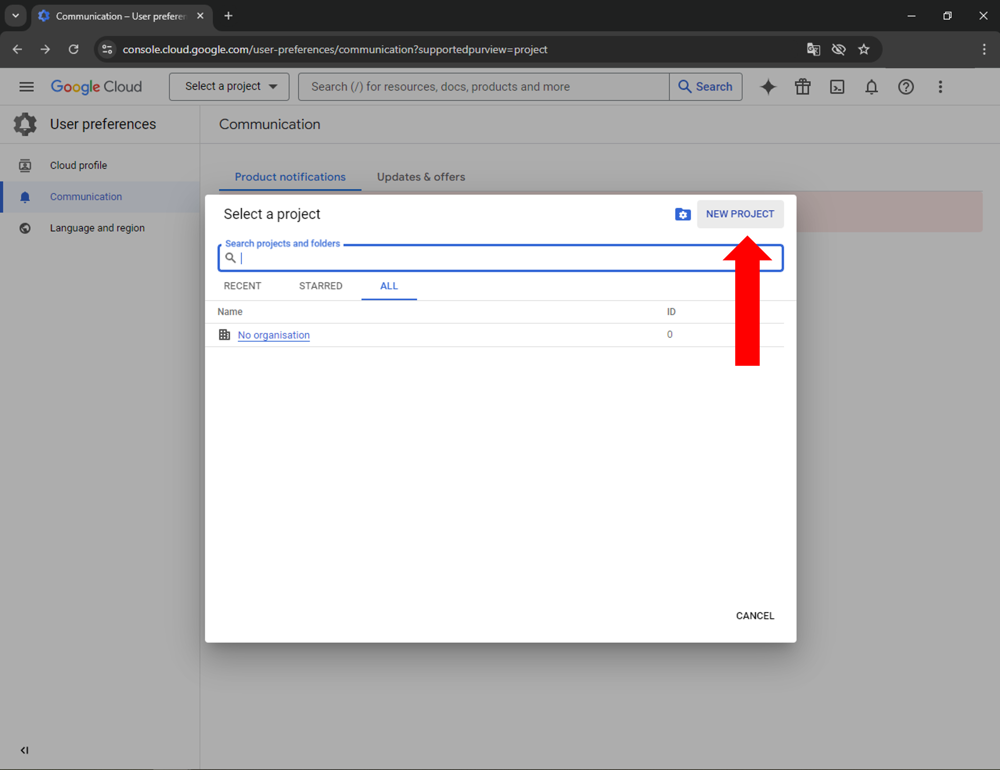
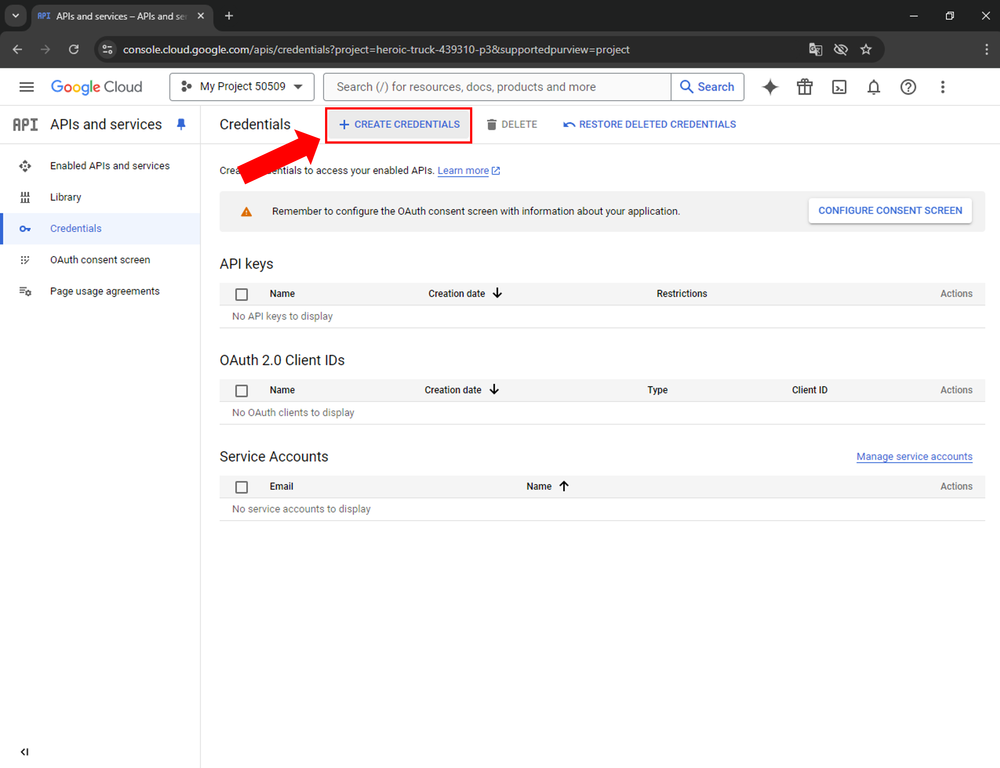
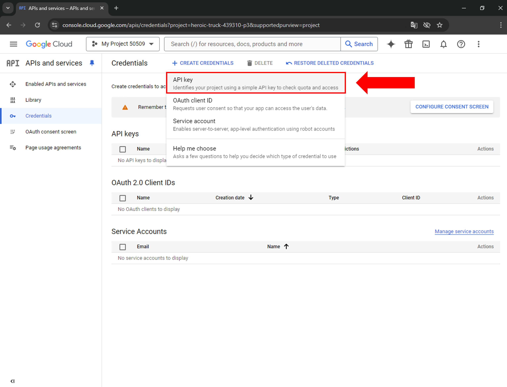
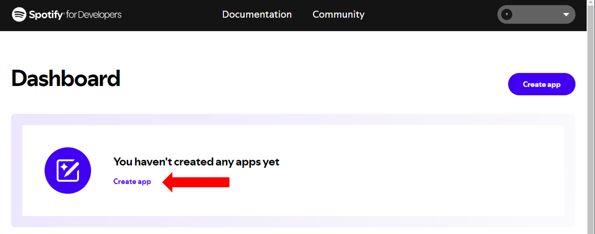
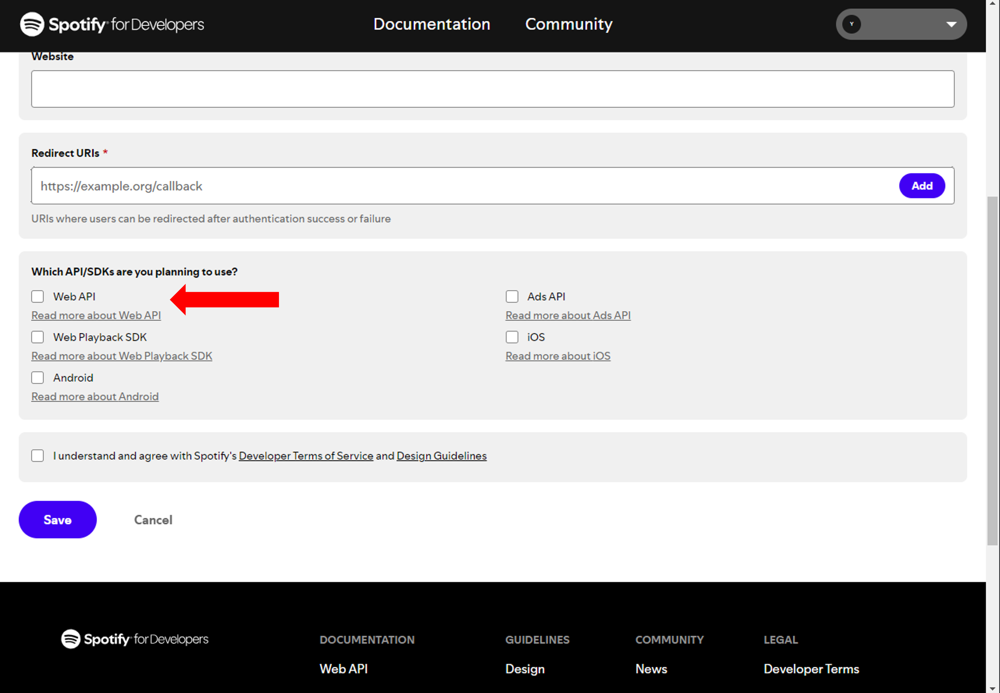
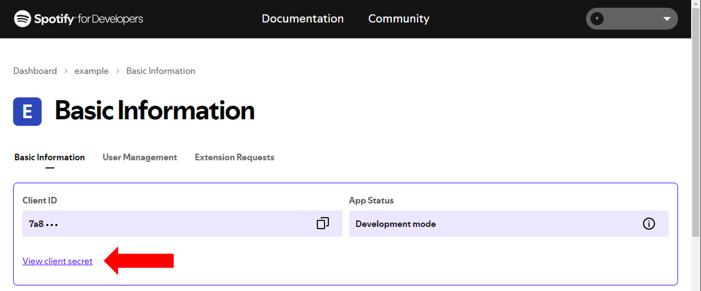
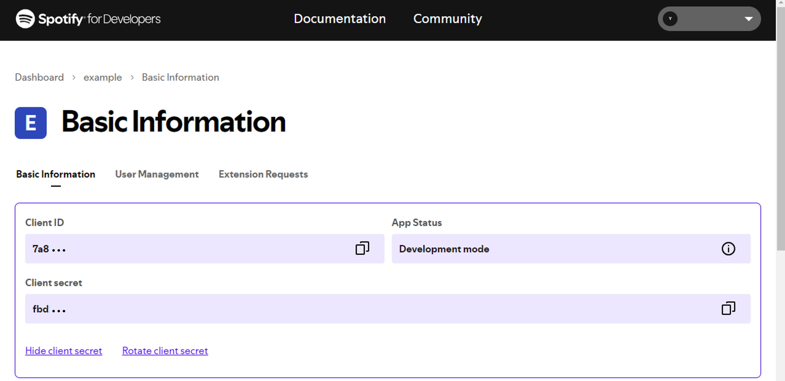

<div style="text-align: center;">
    
</div>

## Description
topFIND is a tool for efficiently retrieving, organizing, and storing various types of online resources, including news, apps, videos, and podcasts.

## Table of Contents
- [Features](#features)
- [Resource sources](#resource-sources)
- [Screenshots](#screenshots)
- [Demo Video](#demo-video)
- [Dependencies](#dependencies)
- [Quickstart](#quickstart)
  - [Prerequisites](#prerequisites)
  - [Preparing the Application](#preparing-the-application)
  - [Running the Application](#running-the-application)
- [Project Structure](#project-structure)
- [License](#license)
- [Authors](#authors)
- [Contact](#contact)

## Features
The main features of topFIND are listed below:
- **Selection of Resource Types**  
  Users can choose from up to four different resource types, allowing for customized resource selection.

- **Advanced Filtering Options**  
  Each resource type comes with its own set of filters, giving users full control to narrow down their selections 
based on specific criteria.

- **Resource Count Visualization**  
  A dynamic visualization displays the total number of selected resources, giving users a clear overview of 
their selection. This feature helps in tracking resource volume and ensures that users are aware of the total 
resources they're working with at any time.

- **Export to ZIP**  
  Users can export their selected resources in a convenient ZIP format, simplifying data transfer and storage. 
This feature makes it easy to download and share all chosen resources in one organized package.

## Resource sources
topFIND is a versatile tool designed to aggregate various types of resources from popular platforms, 
helping users access diverse content with ease. Whether you're looking for videos, news articles, 
podcasts, or apps, topFIND simplifies the process by pulling resources from multiple sources, 
reducing the need to search different platforms manually. Below there is a table showcasing the types 
of resources topFIND retrieves and the platforms they come from:

| Resource Type | Source Platform | Webpage                                          |
|---------------|-----------------|--------------------------------------------------|
| **Videos**    | YouTube         | [youtube.com](https://www.youtube.com)           |
| **News**      | Google news     | [news.google.com](https://news.google.com/)      |
| **Podcasts**  | Spotify         | [spotify.com](https://www.spotify.com)           |
|               | Apple Podcasts  | [podcasts.apple.com](https://podcasts.apple.com) |
| **Apps**      | Google Play     | [play.google.com](https://play.google.com)       |
|               | Apple App Store | [apps.apple.com](https://apps.apple.com)         |


## Screenshots
The home page is as follows: 


The output is displayed as follows:



## Demo Video:

<video width="640" height="360" controls>
  <source src="docs/readme_resources/demo_topFIND.mp4" type="video/mp4">
  Your browser does not support the video tag.
  [Find the demo here](docs/readme_resources/demo_topFIND.mp4)
</video>


## Dependencies

- [streamlit]: an app framework for Machine Learning and Data Science
- [pandas]: data manipulation and analysis library
- [seaborn]: statistical data visualization library
- [matplotlib]: plotting library for Python
- [PIL]: Python Imaging Library for opening, manipulating, and saving images
- [squarify]: library for plotting treemaps
- [nltk]: Natural Language Toolkit for working with human language data
- [altair]: declarative statistical visualization library
- [unidecode]: ASCII transliterations of Unicode text
- [langid]: language identification tool
- [itertools]: functions creating iterators for efficient looping
- [googleapiclient]: Google API Client Library for Python
- [youtube_scraping_api]: API for scraping YouTube data
- [joblib]: set of tools to provide lightweight pipelining in Python
- [googlenews]: library for scraping Google News
- [newspaper]: library for scraping and parsing newspaper articles
- [spotipy]: lightweight Python library for the Spotify Web API
- [bs4]: Beautiful Soup library for web scraping
- [google_play_scraper]: library for scraping Google Play Store data

## Quickstart

Get started with the topFIND tool.

### Prerequisites

Ensure you have the following installed:

- Python 3.7 or higher
- Pip (Python package installer)
- API keys from Google Cloud [Instructions here](#google-cloud)
- API keys from SPOTIFY [Instructions here](#spotify)

### Preparing the Application

1. Clone the repository:
   ```bash
   git clone https://github.com/Vicomtech/topFIND.git
   cd topFIND
2. Create a virtual environment: 
   - In the project directory, create a virtual environment to manage dependencies. Use the following command:
      ```bash
      python -m venv env
   - This will create a folder named env containing all the necessary files for the virtual environment.
     - On **Windows**:
        ```bash
        .\env\Scripts\activate
     - On **macOS/Linux**:
         ```bash
         source env/bin/activate
   - After activating the virtual environment, you should see the environment name in your terminal prompt.

3. Install the required dependencies:
   ```bash 
    pip install -r requirements.txt

### Running the Application
To run the application, you have two options: using the terminal or a run configuration file.

#### 1. Terminal option
1. Add your API keys:
   - Copy the `.env.example` file and rename it to `.topfind.env`.
   - Open the `.topfind.env` file and fill in the required API keys.
   - Save the file. These keys are necessary for the application to interact with external services.
2. Start the Streamlit server:
    ```bash
     python -m streamlit run app/topfind/topfind.py
3. A browser window will automatically open, displaying the running Streamlit app. If it doesn't open automatically, 
you can manually navigate to the following [URL](http://localhost:8501).

#### 2. Configuration file option
1. Set up the run configuration file:
   - Copy Run_configuration_example.xml and specify the Environment Variables: Ensure your environment variables are properly set for the API keys (as in the .env file).
   - Open your IDE (e.g., PyCharm, VS Code) and create a new **Run Configuration** for the application.
2. Run the application:
   - Use the configured run file to start the Streamlit app by selecting the run configuration and clicking "Run."
3. A browser window will automatically open, displaying the running Streamlit app. If it doesn't open automatically, 
you can manually navigate to the following [URL](http://localhost:8501).

### Creating API keys:
#### Google Cloud:
1. **Go to the Google Cloud Console:**
   1. Visit the [Google Cloud Console](https://console.cloud.google.com/apis/credentials?_ga=2.162413884.-107661902.1729000509) to manage your API credentials.
2. **Sign in with your Google Account:**
   1. Log in using your Google credentials, or create a new account if you don’t have one.

3. **Create a New Project:**
   1. In the Cloud Console, click on the Select a project dropdown at the top of the page, then click New Project.
 
   2. Name your project and choose your organization if needed, then click Create.
4. **Click Create credentials, then select API key from the menu.**
   1. Click Create Credentials at the top of the page, then choose API Key from the dropdown menu.
 

#### Spotify:
1. **Create a Spotify Developer Account**  
   - Visit the [Spotify Developer Dashboard](https://developer.spotify.com/dashboard/login).
   - If you don't have a Spotify account, sign up for one. Otherwise, log in with your existing account and go to the dashboard or click in the link above.

2. **Create a New App**  
   - Once logged in, go to the **Dashboard** and click **Create an App**.

   - Provide an app name and description. Agree to the Developer Terms of Service. Select **Web API**.

   - Click **Save** to finish.

3. **Get Your Client ID and Client Secret**  
   - After creating your app, navigate to the app’s dashboard. Click in **Settings**.

   - Your **Client ID** and **Client Secret** (your API keys) will be displayed here. These are required to authenticate your app with the Spotify Web API.


4. **Using the API Key**  
   - Use your **Client ID** and **Client secret** in your app to interact with Spotify’s API.
   
> **Note:** Store your API keys securely and do not share them publicly.

## Project Structure
The repository is structured as follows:

```
topFIND
│
├── app                                     
│   ├── deploy/
│       └── Dockerfile
│   ├── gui/
│       ├── config
│           └── ...
│       ├── modules
│           └── ...
│       ├── utils
│           └── ...
│       └── web.py
│   ├── notebook/
│       └── ...
│   ├── scripts/
│       └── ...
│   └── topfind/
│       ├── pages
│           └── ...
│       ├── utils
│           └── ...
│       └── 1_Search.py
|
├── docs  
│   └── source/  
│       └── ...
|
├── resourcescraper  
│       ├── filter
│           └── ...
│       ├── load
│           └── ...
│       ├── resource-scraper
│           └── ...
│       ├── source-scraper
│           └── ...
│       ├── utils
│           └── ...
│       └── __init__.py
│
├── tests                                   
│   ├── filter
│       └── ...
│   ├── load
│       └── ...
│   ├── scrap
│       └── ...
│   ├── utils
│       └── ...
│   ├── __init__.py
│   └── test.py
│
│
│
├── setup.py                                
├── README.md   
├── CONTRIBUTORS.txt
├── STYLE_GUIDE.md
├── requirements.txt                        
├── dockerfile
├── makefile
├── config.py                              
├── .gitignore                              
├── .dockerignore                              
└── .gitlab-ci.yml                              
```

## License
The tool license is provided in `LICENSE.docx`. As this tool includes serveral python packages, details of package sublicenses are specified in the `LICENSE.md` file. If You intend to make a commercial use of the Software, You shall contact Vicomtech (tech.transfer@vicomtech.org) in order to sign the proper agreement to this effect.

## Authors

* Ander Cejudo
* Teresa Garcia-Navarro
* Yone Tellechea
* Amaia Calvo
* Garazi Artola

## Contact
For any inquiries, feedback, or suggestions regarding the topFIND project, please address them to:

**Name:** Ander Cejudo

**Email:** acejudo@vicomtech.org


[streamlit]: https://streamlit.io/
[pandas]: https://pandas.pydata.org/
[seaborn]: https://seaborn.pydata.org/
[matplotlib]: https://matplotlib.org/
[PIL]: https://python-pillow.org/
[squarify]: https://github.com/laserson/squarify 
[nltk]: https://www.nltk.org/
[altair]: https://pypi.org/project/altair/
[unidecode]: https://pypi.org/project/Unidecode/
[langid]: https://pypi.org/project/langid/
[itertools]: https://docs.python.org/3/library/itertools.html
[googleapiclient]: https://pypi.org/project/google-api-python-client/
[youtube_scraping_api]:https://pypi.org/project/youtube-scraping-api/
[joblib]:https://joblib.readthedocs.io/en/stable/
[googlenews]: https://pypi.org/project/GoogleNews/
[newspaper]: https://newspaper.readthedocs.io/en/latest/
[spotipy]: https://spotipy.readthedocs.io/en/2.24.0/
[bs4]: https://pypi.org/project/bs4/
[google_play_scraper]: https://pypi.org/project/google-play-scraper/

